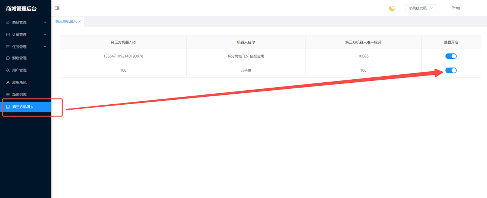

# 接口说明

正式环境地址: https://open.fanbook.mobi/mp/138519745866498048/368331042878263296/shop-manage-pc/{接口地址}


## 1.应用参数申请

第三方机器人开发者需要提供应用名称、机器人 ID 等参数，提交给积分商城开发人员。待创建应用参数成功后，会提供 AppKey、AppSecret 两项参数用于积分商城的开放接口方法签名。

## 2.方法签名

**签名规则示例**

```
-- 应用参数
AppKey：esdx8ol13uelo6enblwh
AppSecret: di4uep1ed5i5m48zhrcm

-- 模拟接口curl
curl --request POST 'http://localhost:8052/api/core/open/modifyUserPoint?random=test-params' \
--header 'AppKey: esdx8ol13uelo6enblwh' \
--header 'Nonce: z00wu1fzglfyqzk1tol5' \
--header 'Timestamp: 1664250286491' \
--header 'Signature: 054f69f3e62e8835052ef593c1fa9df8' \
--header 'Content-Type: application/json' \
--data '{"bizId":"zw0chebvkt","fbLongId":173022860380475392,"guildId":357042844231282688,"point":666,"remark":"天梯第一名, 奖励666分"}'

-- 签名拼接后字符串
di4uep1ed5i5m48zhrcm&AppKey=esdx8ol13uelo6enblwh&Nonce=z00wu1fzglfyqzk1tol5&Timestamp=1664250286491&random=test-params&requestBody={"bizId":"zw0chebvkt","fbLongId":173022860380475392,"guildId":357042844231282688,"point":666,"remark":"天梯第一名, 奖励666分"}&di4uep1ed5i5m48zhrcm

-- MD5加密后的签名
054f69f3e62e8835052ef593c1fa9df8
```

## 3.接口列表

### 3.1 获取用户积分数

**接口地址:** `/api/core/open/getUserPoint`

**请求方式:** `GET`

**请求数据类型:** `application/json`

**响应数据类型:** `application/json`

**接口描述:** `查询指定服务器的指定用户的积分。`

**请求参数**

| 参数名称 | 参数说明     | in    | 是否必须 | 数据类型       |
| -------- | ------------ | ----- | -------- | -------------- |
| guildId  | FB 服务器 ID | query | TRUE     | integer(int64) |
| userId   | FB 用户长 ID | query | TRUE     | integer(int64) |

**响应状态**

| 状态码 | 说明         |
| ------ | ------------ |
| 200    | OK           |
| 401    | Unauthorized |
| 403    | Forbidden    |
| 404    | Not Found    |

**响应参数**

| 参数名称 | 参数说明                                                                  | 类型           |
| -------- | ------------------------------------------------------------------------- | -------------- |
| code     | 当前仅当 code 等于 0 时，代表业务逻辑处理成功。否则代表业务逻辑处理失败。 | integer(int32) |
| data     | 获取用户积分响应模型                                                      |                |
| guildId  | FB 服务器 id                                                              | string         |
| point    | FB 用户的商城积分                                                         | integer(int32) |
| userId   | FB 用户长 id                                                              | string         |
| msg      |                                                                           | string         |

**响应示例:**

```
{
  "code": 0,
  "msg": "SUCCESS",
  "data": {
    "guildId": "357042844231282688",
    "userId": "173022860380475392",
    "point": 2484278
  }
}
```

### 3.2 加减用户积分数

**接口地址:** `/api/core/open/modifyUserPoint`

**请求方式:** `POST`

**请求数据类型:** `application/json`

**响应数据类型:** `application/json`

**接口描述:** `对用户的积分进行加减；如果用户积分不足，则不会扣减用户积分`

**请求示例:**

```
{
  "bizId": "zw0chebvkt",
  "fbLongId": 17302286000000000,
  "guildId": 3570428442000000,
  "point": 666,
  "remark": "天梯第一名, 奖励666分"
}
```

**请求参数:**

| 参数名称 | 参数说明                                                                                            | in   | 是否必须 | 数据类型                 |
| -------- | --------------------------------------------------------------------------------------------------- | ---- | -------- | ------------------------ |
| request  | request                                                                                             | body | TRUE     | 修改用户积分请求参数模型 |
| bizId    | 添加积分的事务 id;可以使用比如订单 id 或者其他随机字符，用于比对每条积分记录的来源;字符长度小于 100 |      | TRUE     | string                   |
| fbLongId | fb 用户长 id                                                                                        | body | TRUE     | integer(int64)           |
| guildId  | FB 服务器 id                                                                                        |      | TRUE     | integer(int64)           |
| point    | 用户积分数;数值范围[-9999, -1] ~ [1, 9999]                                                          |      | TRUE     | integer(int32)           |
| remark   | 添加积分备注;字符长度小于 100                                                                       |      | TRUE     | string                   |


**响应状态**

| 状态码 | 说明         |
| ------ | ------------ |
| 200    | OK           |
| 201    | Created      |
| 401    | Unauthorized |
| 403    | Forbidden    |
| 404    | Not Found    |

**响应参数**

| 参数名称 | 参数说明                                                                  | 类型           |
| -------- | ------------------------------------------------------------------------- | -------------- |
| code     | 当前仅当 code 等于 0 时，代表业务逻辑处理成功。否则代表业务逻辑处理失败。 | integer(int32) |
| data     | 获取用户积分响应模型                                                      |   ModifyUserPointResponse             |
| code     | 失败错误码                                                               | intege(int32)       |
| fbLongId | FB用户长id                                                               | integer(int64) |
| guildId  | FB服务器id                                                               | integer(int64) |
| message  |  失败原因                                                                | string         |
| msg      |                                                                         | string         |


**响应示例:**

```
{
  "code": 0,
  "msg": "SUCCESS",
  "data": {
    "guildId": 35704284420000000,
    "fbLongId": 1730228603000000,
    "code": 0,
    "message": ""
  }
}
```


### 3.3 批量加减用户积分数


**接口地址:** `/api/core/open/batchModifyUserPoint`

**请求方式:** `POST`

**请求数据类型:** `application/json`

**响应数据类型:** `application/json`

**接口描述:** `可以批量对用户的积分进行加减；`

**请求示例:**

```
{
  "guildId": 357042844231282688,
  "pointList": [
    {
      "bizId": "vov0aar2lt",
      "fbLongId": 173022860380475392,
      "point": -666,
      "remark": "天梯倒数第一名"
    },
    {
      "bizId": "e6r5o9txp8",
      "fbLongId": 173022860380475392,
      "point": -666,
      "remark": "天梯倒数第一名"
    }
  ]
}
```

**请求参数:**

| 参数名称 | 参数说明                                                                                            | in   | 是否必须 | 数据类型                 |
| -------- | --------------------------------------------------------------------------------------------------- | ---- | -------- | ------------------------ |
| request  | request                                                                                             | body | TRUE     | 批量修改用户积分请求模型 |
| guildId  | FB 服务器 id                                                                                        |      | TRUE     | integer(int64)           |
| pointList| 用户的修改积分列表;集合大小是[1, 1000]                                                               |      | TRUE     | array	修改用户积分的集合           |
| bizId    | 添加积分的事务 id;可以使用比如订单 id 或者其他随机字符，用于比对每条积分记录的来源;字符长度小于 100 |     | TRUE     | string                   |
| fbLongId | fb 用户长 id                                                                                        | body | TRUE     | integer(int64)           |
| point    | 用户积分数;数值范围[-9999, -1] ~ [1, 9999]                                                          |      | TRUE     | integer(int32)           |
| remark   | 添加积分备注;字符长度小于 100                                                                       |      | TRUE     | string                   |


**响应状态**

| 状态码 | 说明         |
| ------ | ------------ |
| 200    | OK           |
| 201    | Created      |
| 401    | Unauthorized |
| 403    | Forbidden    |
| 404    | Not Found    |

**响应参数**

| 参数名称 | 参数说明                                                                  | 类型           |
| -------- | ------------------------------------------------------------------------- | -------------- |
| code     | 当前仅当 code 等于 0 时，代表业务逻辑处理成功。否则代表业务逻辑处理失败。 | integer(int32) |
| data     | 获取用户积分响应模型                                                      |   ModifyUserPointResponse             |
| code     | 失败错误码                                                               | intege(int32)       |
| fbLongId | FB用户长id                                                               | integer(int64) |
| guildId  | FB服务器id                                                               | integer(int64) |
| message  |  失败原因                                                                | string         |
| msg      |                                                                         | string         |


**响应示例:**

```
{
  "code": 0,
  "msg": "SUCCESS",
  "data": [
    {
      "guildId": 357042844231282688,
      "fbLongId": 173022860380475392,
      "code": 0,
      "message": ""
    },
    {
      "guildId": 357042844231282688,
      "fbLongId": 173022860380475392,
      "code": 0,
      "message": ""
    }
  ]
}
```


## 4.应用授权

积分商城 web 管理端地址：https://open.fanbook.mobi/mp/138519745866498048/368331042878263296/shop-manage-pc/

第三方机器人接入积分商城开放接口后，每个服务器都需要单独申请授权后，才允许操作对应服务器的相关接口。



**第三发应用授权相关错误码：**

| 错误码 | 描述                       | 解释                                                                   |
| ------ | -------------------------- | ---------------------------------------------------------------------- |
| 60000  | 当前应用被禁止使用         | 该应用被积分商城开发人员全局禁止访问任何服务器的开放接口数据           |
| 60001  | 当前应用未开启或被禁止使用 | 对应的服务器管理员未开启该应用的授权，可以联系服务器管理员开启授权功能 |
| 60004  | 授权应用不存在             | 应用参数不正确或应用不存在                                             |
